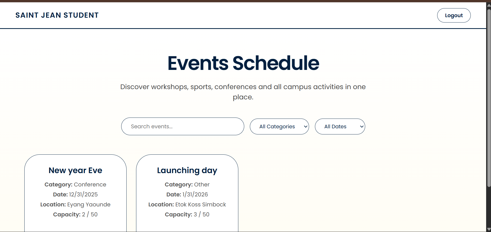
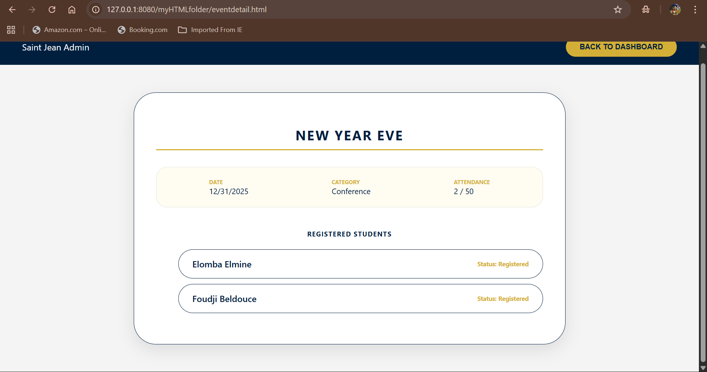
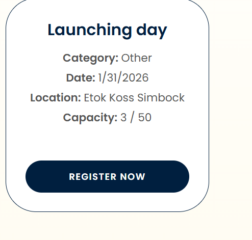

1. Project Presentation
   ## What is this app?
I built this app to help my school, Saint Jean, manage events better. It has two sides: a Student side where people can find and join events, and an Admin side where someone can create new events and delete old ones.

## What I wanted to achieve:
Make it look really professional with a Navy Blue and Gold theme.
Make sure students can’t sign up for the same thing twice.
Make sure events stop taking people once they are full.

 ## Tech I used:
TypeScript: To handle the logic and make sure the data (like event names and dates) stays organized.
HTML/CSS: I used a lot of Flexbox and Grid to make the "event cards" look clean.

2. Implemented Features
     Feature              Status(OK/partial/missing)
Create events                     OK
Display full event list           OK
Filter events                     OK
Event detail page                 OK
User Registration                 OK
Duplicate registration protection OK
Capacity Control                  OK
+Bonus: -dark mode                Missing
        -Responsive               Missing

3. Project Structure
-myHTMLfolder/welcome.html: This is the welcome page where you choose if you are a Student or Admin.
-myHTMLfolder: contains all my html files ofor better presentation.
-styles/: This folder has all my CSS. Each page has its own file to keep things tidy.
-src/myTSfoler/models.ts: This is where the "brain" of the app is. It handles the clicks and the math for the capacity.
-src/myTsfolder: Contains all the typescript of all the different files.
-dist/: This is where the TypeScript gets turned into regular JavaScript so the browser can read it.

4. Installation & Execution
Run npm install to get the tools ready.
Run npm run build to compile my TypeScript code.
Open welcome.html using Live Server in VS Code to see it in action.

5. How to Use the Application
-To Create an Event: Go to the Admin page(default adminUsername: admin, password:123). Fill in the boxes (Title, Date, Category). When you hit Publish, the code saves it and sends it to the Student page.

-To view event details: Log in as an Admin,On the Dashboard, click anywhere on an Event Card.
You will be redirected to eventdetails.html where the specific selectedEventId is fetched from localStorage.View the list of registered students and event statistics.

-To Search/Filter: I added a search bar at the top of the Student page. If you type "Workshop," only workshops show up.

-To Register as a student: Once login as a student,Click the Register button on any event card. It will use your previous details entered when signing up and register you successively.

-When it's Full: I wrote a check in the code: if (registrations >= maxCapacity). If that’s true, the button turns grey and you can’t click it anymore.

-When you want to register twice: An alert pops out telling you, you are already registered.
6. Screenshots
home page:
Event-Detail:
Register_form: 
Mobile view: Missing

7. Conclusion & Limitations
## Strengths: 
The primary success of this project lies in its Visual Identity and User Experience. I am particularly proud of the cohesive Navy and Gold color palette, which was selected to evoke the prestige and tradition of a university environment.

 -Pill-Shaped Architecture: Rather than standard rectangular inputs, I implemented a "Pill" design across the entire UI. While this presented challenges in CSS padding and text alignment, it resulted in a modern, approachable aesthetic that differentiates the app from generic management tools.
 -Modular TypeScript: The logic is strictly separated into Models and Controllers, making the code highly readable and scalable for future expansion.

## Difficulties:
 -Complex CSS Layouts: One of the most significant difficulties was managing element centering. Using position: absolute for button labels created alignment issues across different screen sizes. I eventually resolved this by utilizing Flexbox and Grid layouts, which allowed for perfect centering without breaking the responsive flow.
 -Cross-Page Data Syncing: Initially, I encountered an issue where events created by the Admin wouldn't populate for the Student until a hard refresh occurred. To solve this, I optimized the DataStore to initialize data directly from localStorage upon page load, ensuring that the Student and Admin views always stay synchronized without manual intervention.

## Improvements: 
Given additional development time, I would expand the application's functionality in the following areas:

 -Student Profile & History: I would implement a "My Registered Events" section where students can view, manage, and unregister from events they have already joined.
 -Accessibility & Adaptability: Adding a Dark Mode toggle using CSS variables to accommodate different lighting environments and user preferences.
 -Real-Time Notifications: Integrating a notification system to alert students when an event is nearing capacity or when a new event in their favorite category is posted.
 -Persistent Auth: Currently, the session clears on tab closure. I would move towards a more robust token-based system to keep users logged in securely over longer periods.

8. Author Information
Full Name: Elomba Elmine Nwenjoh

Student ID: 2425L067

Email: elmine.elomba@saintjeaningenieur.org